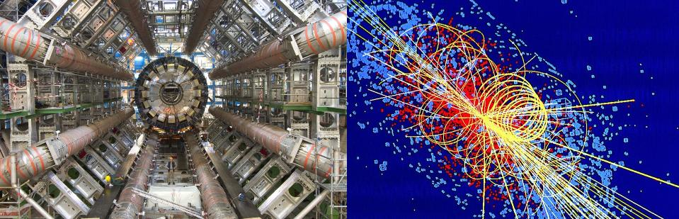

# Datasets-for-Fundamental-Physics
A collection of datasets for exploring fundamental physics with machine learning

### CERN: Open Data Portal ( https://opendata.cern.ch/ )

### CERN: Public Datasets ( https://iml.web.cern.ch/public-datasets )

### CERN: Inter-Experimental LHC Machine Learning Working Group ( https://iml.web.cern.ch/homepage )

### HEPML-LivingReview: A Living Review of Machine Learning for Particle Physics ( https://iml-wg.github.io/HEPML-LivingReview/ )

### Kaggle: Higgs Boson Machine Learning Challenge - Use the ATLAS experiment to identify the Higgs boson ( https://www.kaggle.com/c/higgs-boson )

### SUSY Dataset

* Paper: Baldi, Pierre, Peter Sadowski, and Daniel Whiteson. "Searching for exotic particles in high-energy physics with deep learning." Nature communications 5, no. 1 (2014): 1-9. ( https://www.nature.com/articles/ncomms5308 ) ( https://www.nature.com/articles/ncomms5308.pdf )

* Data access: https://archive.ics.uci.edu/ml/datasets/SUSY

* Tutorial: http://physics.bu.edu/~pankajm/MLnotebooks.html , http://physics.bu.edu/~pankajm/ML-Notebooks/HTML/NB5_CVII-logreg_SUSY.html , http://physics.bu.edu/~pankajm/ML-Notebooks/HTML/NB10_CVIII-XGboost_susy.html , http://physics.bu.edu/~pankajm/ML-Notebooks/HTML/NB13_CIX-DNN_susy_Pytorch.html

* Other resources: https://github.com/thugsatbay/ML-SUSY-DataSet

### The LHC Olympics 2020: A Community Challenge for Anomaly Detection in High Energy Physics (https://lhco2020.github.io/homepage/ ) ( https://arxiv.org/abs/2101.08320 )

### The Dark Machines Anomaly Score Challenge: Benchmark Data and Model Independent Event Classification for the Large Hadron Collider ( https://arxiv.org/abs/2105.14027 )
* Paper: Aarrestad, Thea, Melissa van Beekveld, Marcella Bona, Antonio Boveia, Sascha Caron, Joe Davies, Andrea De Simone et al. "The dark machines anomaly score challenge: benchmark data and model independent event classification for the large hadron collider." SciPost Physics 12, no. 1 (2022): 043. ( https://www.scipost.org/10.21468/SciPostPhys.12.1.043 ) ( https://arxiv.org/abs/2105.14027#:~:text=version%2C%20v3)%5D-,The%20Dark%20Machines%20Anomaly%20Score%20Challenge%3A%20Benchmark%20Data%20and%20Model,for%20the%20Large%20Hadron%20Collider&text=We%20describe%20the%20outcome%20of,on%20Physics%20at%20TeV%20colliders. )

### Shared Data and Algorithms for Deep Learning in Fundamental Physics ( https://arxiv.org/abs/2107.00656 ) ( https://github.com/erum-data-idt/pd4ml )

### LHC physics dataset for unsupervised New Physics detection at 40 MHz ( https://arxiv.org/abs/2107.02157 )

### A FAIR and AI-ready Higgs Boson Decay Dataset ( https://arxiv.org/abs/2108.02214 )

### Particle Transformer for Jet Tagging ( https://arxiv.org/abs/2202.03772 )

# Other Papers of Note

#### Karagiorgi, Georgia, Gregor Kasieczka, Scott Kravitz, Benjamin Nachman, and David Shih. "Machine learning in the search for new fundamental physics." Nature Reviews Physics (2022): 1-14. ( https://www.nature.com/articles/s42254-022-00455-1 ) ( https://arxiv.org/pdf/2112.03769.pdf )

#### Carrasquilla, Juan, and Giacomo Torlai. "Neural networks in quantum many-body physics: a hands-on tutorial." arXiv preprint arXiv:2101.11099 (2021). ( https://arxiv.org/abs/2101.11099 )

#### Special Issue "Fundamental Physics and Machine Learning ( https://www.mdpi.com/journal/entropy/special_issues/Fundam_Phys_Mach_Learning )